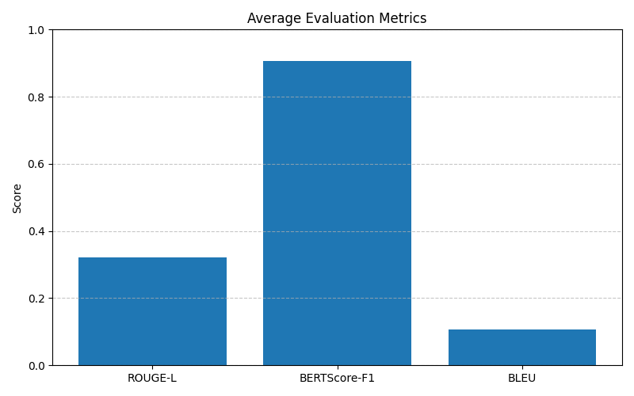

# Agentic-Chatbot

## Project Description 
This project is a full-stack web app that implements an Agentic AI Chatbot for Duke University. The chatbot is able to answer different questions about Duke's curriculum, events, and locations on campus. The front-end is implemented with React + Vite, while the backend is implemented with Flask. The backend is hosted on an EC2 Instance and receives queries from the frontend via a web socket that passes messages to the EC2 through Lambda functions. The backend utilizes LangChain to implement an agentic workflow and uses GPT-4o-mini as the LLM for the agents to process the queries. 

This chatbot is designed for incoming duke students or students considering applying to Duke University. Furthermore, the chatbot is meant to have a friendly and helpful tone that helps users retrieve the information they are looking for. Given that we students in the Duke AIPI program, the chatbot is more oriented towards answering questions about our program, but is able to answer questions about other programs and courses as well. 

## Project Structure 

```
Agentic-Chatbot/
├── evaluation/
│   ├── eval.py                  # Evaluation logic for the chatbot
│   ├── llm_eval_results.csv     # Results of language model evaluations
│   ├── visualization.py         # Scripts for visualizing evaluation results
├── frontend/                    # frontend repo for the REACT app 
├── server/
│   ├── agents/
│   │   ├── __init__.py          # Initialization for the agents module
│   │   ├── base_agent.py        # Base class for chatbot agents
│   │   ├── curriculum_agent.py  # Agent handling curriculum-related tasks (Duke Curriculum API)
│   │   ├── events_agent.py      # Agent managing event-related queries (Duke Events API)
│   │   ├── locations_agent.py   # Agent for location-based queries (Duke Places API)
│   │   ├── router_agent.py      # Router agent that implements routing logic between different agents
│   ├── data/
│   │   └── metadata/
│   │       └── subjects.json    # Metadata file containing subject information
│   ├── services/
│       ├── duke_api_service/
│            └── __init__.py   
│            └── base.py         # Base API class (reusable code across all Duke APIs)
│            └── curriculum.py   # Class implementing calls to the Duke curriculum API routes
│            └── events.py       # Class implementing calls to the Duke events API routes
│            └── places.py       # Class implementing calls to the Duke places API routes
│       ├── __init__.py      # Initialization for Duke API services
│       ├── pinecone_services.py  # Integration with Pinecone vector database
│       ├── query_service.py      # Service handling query operations (synchronously)
│       ├── webscraping_service.py # Service for web scraping operations (executed locally)
│       ├── tools/
│           ├── __init__.py           
│           ├── duke_api_tools.py  # Script implementing the tools used by agents (using the Duke API)
│   ├── app.py                   #  Main application logic (entry point of the EC2)
│   ├── lambda_handler.py        # Code that goes in the AWS Lambda
├── test/                        # Directory for test cases (if applicable)
├── .gitignore                   # Git ignore file specifying untracked files
├── LICENSE                      # License file for the project
├── README.md                    # Documentation file (this file)
├── requirements.txt             # Python dependencies for the project
├── upload_to_pinecone.py        # Script to upload data to Pinecone vector database (done locally)
```
## Modeling Decisions 

Since this project is an agentic chatbot, we decided to use two main sets of tools: 

#### 1. RAG System (PineCone) 

The RAG system is used to save data scraped offline from different websites, namely "https://masters.pratt.duke.edu/*", "https://gradschool.duke.edu/academics/*", "https://admissions.duke.edu/academic-possibilities/*", as well as any relevant information pertaining to Duke University on Wikipedia. 
(Note: the * indicates all pages under the URL) 

Since most of the data in the RAG system pertains to the curriculum, the curriculum agent utilize the data from the vector DB to augment its answers. 

In order to handle the large document sizes while avoiding issues regarding token limits, we decided to use a paragraph based chunking approach. We split the text into seperate chunks based on the paragraph boundaries while maintaining the 8,000 token limit of the embedding model. When a paragraph exceeded this limit, we implemented a sliding window technique to ensure the embeddings have a natural language structure and no information is lost. 

The embeddings from multi chunk documents were averaged to create one representation per file. To trace the responses back to their source, we stored the metadata (including the original path) with each embedding. Lastly we uploaded the embeddings to pinecone in batches of 100.

#### 2. Duke API

Duke University offers an API that we were able to access as students. The API offers routes that allowed us to access information pertaining to curriculum, events, and different locations on campus. We have implemented a duke API service that has code accessing all the different routes. The agents then utilize these functions as tools to retrieve information based on the query. 
NOTE: we have created a subjects.json under `data/metadata`, which is used to call the curriculum API since the subjects are pre-determined and we had to scrape them from the Duke API page to be able to make the API calls. 

## System architecture 

#### System Architecture
The architecture of the chatbot is modular, agent-based, and designed to be scalable and maintainable. The backend logic is centralized in app.py, which serves as the main entry point for handling user queries and routing them to the appropriate agents. Each agent is designed to handle a specific domain: curriculum, events, or locations.

#### Router Agent Design:
The RouterAgent is the central decision-maker. It is initialized with access to all specialized agents and uses a dedicated system prompt to determine which agent(s) should handle a given query. For cross-domain questions, it combines responses from multiple agents using a final synthesis LLM call. The router shares memory with all agents, allowing it to consider previous messages and maintain session context.

#### Agent Specialization:
Each agent (CurriculumAgent, EventsAgent, LocationsAgent) inherits from a BaseAgent that defines shared behavior and interface. This avoids code duplication and ensures consistent structure. Each agent has a custom system prompt and a tailored set of LangChain tools that wrap around the corresponding Duke API calls. Each LangChain tool has a detailed description outlining its use cases, while having special instructions dealing with bottlenecks that it ran to during testing. 

#### Service Layer:

- `duke_api_service/` abstracts calls to Duke’s APIs (curriculum, events, and locations).

- `pinecone_services.py` handles interactions with the Pinecone vector store for RAG-based retrieval.

- `query_service.py` manages chat session memory and coordinates agent interactions.

- `webscraping_service.py` is responsible for collecting data offline, which is then uploaded to Pinecone using upload_to_pinecone.py.

#### Metadata Handling:
The `data/metadata/subjects.json` file contains pre-fetched subject codes required by the curriculum API. These codes were scraped manually and are used dynamically by the curriculum tools during inference.

This architecture ensures separation of concerns, clean routing logic, and flexible agent management — making it easier to debug or extend the system in the future.

## Performance Evaluation 

The performance of the chatbot was evaluated both quantitatively and qualitatively.

### Automatic Evaluation:
The eval.py script tests the chatbot against 20 curated benchmark questions with known ground truth answers. For each question, the chatbot's response is compared using:

- **ROUGE-L**: Measures overlap of longest common subsequences.

- **BERTScore-F1**: Embedding-based similarity metric.

- **BLEU**: Measures n-gram overlap with the reference answer.

Results are saved in `llm_eval_results.csv`.

### User Evaluation:
Five users were asked to rate each response from the chatbot on a 1–5 scale based on helpfulness and accuracy, where 5 indicates an accurate and helpful response. The average of these scores is recorded as the "User Score" for each question in the same CSV file.
Average user rating: 4.12

#### Visualization:
To better understand the results, visualization.py generates visual summaries:

- Bar charts for individual metric scores per query.

- Aggregated bar charts for average ROUGE, BERTScore, BLEU, and User Score.

These visualizations help diagnose underperforming areas and inform future system improvements.




## Approach to Cost Minimization
To keep inference costs low while maintaining performance, several strategies were implemented:

#### Selective Agent Invocation:
Instead of invoking all agents for each query, the RouterAgent dynamically selects the most relevant agent(s). This reduces unnecessary LLM calls and minimizes latency and cost. Furthermore, the agents are ran in parallel if multiple agents are required at once. 

#### Query Filtering at the Edge:
The AWS Lambda function pre-filters incoming queries and rejects those unrelated to Duke University. This prevents unnecessary backend computation and LLM usage.

#### Model Selection:
The chatbot uses GPT-4o-mini, a lighter-weight variant of GPT-4o, which offers strong performance with significantly lower costs. Prompt engineering was used to maximize the performance of this smaller model without relying on a more expensive alternative.

#### Efficient Memory Management:
Shared memory across agents avoids redundant LLM context initialization and ensures better performance with fewer tokens per call.

#### Offline Data Scraping + RAG:
Relevant Duke-related web content was scraped offline and embedded into a Pinecone vector store. This allows the curriculum agent to answer curriculum-related questions without requiring expensive live calls to the LLM for all queries, while minimizing latency since the resources scraped from the websites are static

Together, these strategies ensure that the chatbot remains scalable and cost-efficient while still providing helpful, high-quality answers.


## Demo 
[INSERT LINK TO THE DEMO HERE]

